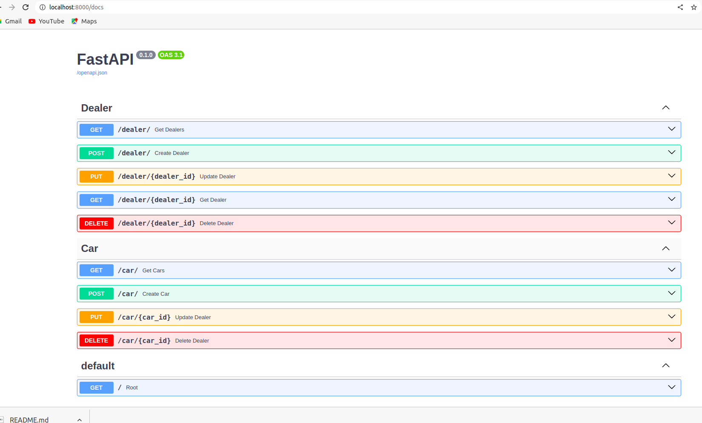

## FastAPI Project to manage car dealers

This is a simple REST API built with Python and FastAPI and SQLAlchemy for CRUD operations (Create, Read, Update, Delete) for car dealers.

## Installation

# Python Version 3.10

# Windows: Environment Setup
```commandline
python3 -m venv ..\cardealer_python_env
..\cardealer_python_env\Scripts\activate
```

# Linux: Environment Setup
```commandline
python3 -m venv ../cardealer_python_env
source ../cardealer_python_env/bin/activate
```

Clone this repository to your local machine:
```bash
git clone https://github.com/Shalice-relevantz/CarDealer.git
```

Change into the project directory:

```bash
cd Car-dealer
```

Install the project dependencies:

```bash
pip install -r requirements.txt
```

Run the application:

```bash
uvicorn main:app --reload
```

The application will start and be available at http://localhost:8000.

# Swagger Docs: All Endpoint are available here
```commandline
http://127.0.0.1:8000/docs
```

#API ROUTES FOR DEALER
```commandline
    # GET - http://localhost:8000/dealer/
    # POST  - http://localhost:8000/dealer/
    # PUT  - http://localhost:8000/dealer/{dealer_id}
    # GET  - http://localhost:8000/dealer/{dealer_id}
    # DEL  - http://localhost:8000/dealer/{dealer_id}
```
    
```
#API ROUTES FOR CARS
```commandline
    # GET - http://localhost:8000/cars/
    # POST  - http://localhost:8000/cars/
    # PUT  - http://localhost:8000/cars/{car_id}
    # DEL  - http://localhost:8000/cars/{car_id}
```


## API Endpoints

### Retrieve a list of dealers:

```http
GET /dealers
```

Returns a list of all dealers in the system:

```console
curl http://localhost:8000/dealers/ -H "Accept: application/json"
```
Response:

```json
{
  "status": "success",
  "results": 3,
  "dealers": [
    {
      "name": "Maruti indus",
      "address": "Kothamangalam",
      "id": 1,
      "phone": "9847012345"
    },
    {
      "name": "Popular hundai",
      "address": "perumbavoor",
      "id": 2,
      "phone": "9544012345"
    },
    {
      "name": "EVM honda",
      "address": "Muvattupuzha",
      "id": 3,
      "phone": "7200654321"
    }
  ]
}
```

#### In the same way we can trigger all the API endpoints from docs.



#Note:
```commandline
    # Why FastApi?
        FastAPI is a powerful web framework for building APIs.
        FastAPI is faster due to its asynchronous code and type annotations.
        FastAPI has automatic data validation and documentation.

        We can compare multiple frameworks that are available and select the most suitable one based on the requirements.
        I have implemented default validation using Pydantic and SQLAlchemy, as well as custom validation for the 'dealer' field when creating cars.

    
    # Below things i planned to add but due to time, i suppose to limit with basic needs. 
         1) I have added a common exception handling and logger as middlewares, We can delve deeper into this aspect at a later stage.
         2) We can generate a token based authentication for the delaers signup/login
         3) Implement async/await functionality on project demands.         
```


